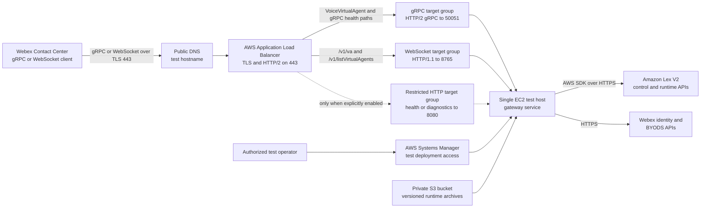

# AWS Test Deployment Considerations

This document describes a known-working AWS hosting pattern for a controlled BYOVA Gateway
test environment. It shows how the gateway can sit behind an AWS Application Load Balancer
(ALB), serve gRPC and WebSocket BYOVA traffic from one process, and call Amazon Lex V2. The
known-working path uses EC2. The container image can also run under a compatible orchestrator,
but environment-specific infrastructure is intentionally maintained outside this shared
example repository. Neither path is a production deployment design or a claim of production
readiness.

All names and values below are placeholders. Do not add AWS account numbers, resource ARNs,
instance IDs, subnet IDs, security-group IDs, target-group IDs, certificate IDs, access keys,
tokens, or private deployment aliases to this repository.

## Scope and validation boundary

The test pattern covered here has exercised these infrastructure behaviors:

- Public DNS and a valid TLS certificate terminate at an internet-facing ALB.
- The ALB accepts HTTP/2 gRPC traffic on TCP 443 and forwards it to the gateway's gRPC
  listener on TCP 50051.
- The same HTTPS listener upgrades `/v1/va` and `/v1/listVirtualAgents` to WebSockets and
  forwards them through a distinct HTTP/1.1 target group to TCP 8765.
- A separate target group can route limited HTTP health or diagnostic traffic to TCP 8080.
- A single EC2 test host runs the Python gateway as a managed service.
- Versioned runtime archives can be delivered through a private S3 bucket and installed
  through AWS Systems Manager (SSM), without public SSH access.
- The gateway uses the standard AWS SDK credential chain; an EC2 workload role can authorize
  Amazon Lex discovery and runtime requests without static AWS access keys.
- Gateway-owned BYODS registration and JWS renewal can run from host-owned environment
  configuration outside the release archive.

The ALB-to-EC2 hosting path is provider-neutral. Amazon Lex is selected at the connector
layer. A healthy ALB target or successful gateway health request does not, by itself, prove
that a particular Lex bot, Webex organization, or end-to-end call is working. Revalidate the
Lex connector and a real test call after every material deployment or configuration change.

## Known-working test topology



The monitoring interface is a development aid. Keep it disabled, private, or protected by
appropriate authentication and network controls. Do not assume that publishing the gRPC
endpoint also authorizes publishing the monitoring dashboard.

## Resource responsibilities

| Resource | Test-environment responsibility | Important considerations |
| --- | --- | --- |
| DNS record | Resolves the test hostname to the ALB. | The hostname must match the certificate and the URL registered with BYODS. Use a placeholder in committed examples. |
| ACM certificate | Provides a valid certificate for the test hostname. | The certificate must be in the same AWS Region as the ALB. Prefer DNS validation and managed renewal. |
| Application Load Balancer | Terminates TLS and routes both protocols. | Use one HTTPS listener on port 443, HTTP/2 gRPC path rules, and HTTP/1.1 WebSocket path rules. Confirm long-lived bidirectional behavior for both transports. |
| gRPC target group | Sends BYOVA RPCs to gateway port 50051. | Use protocol `HTTP`, protocol version `GRPC`, and an explicit successful gRPC health code for the implemented health method. |
| WebSocket target group | Sends WebSocket upgrades and frames to gateway port 8765. | Use protocol `HTTP`, protocol version `HTTP1`, and `/health` for the private target health check. Do not point it at the monitoring process. |
| HTTP target group | Optionally exposes `/health` or restricted diagnostics on port 8080. | Do not expose the dashboard publicly merely to obtain a health check. A dedicated health-only path is safer. |
| EC2 test host | Runs the gateway, connector, and optional monitoring process. | The observed test arrangement is a single host and is not highly available. Keep configuration and secrets outside release archives. |
| EC2 IAM role | Supplies short-lived AWS credentials to the gateway. | Grant only the required Lex, release-download, and management permissions. Do not store access keys on disk or in YAML. |
| Private S3 bucket | Stores versioned gateway runtime archives. | Block public access, encrypt objects, retain checksums, and scope read access to the test host or deployment role. |
| Systems Manager | Provides controlled host access and release installation. | Prefer Session Manager or Run Command over inbound SSH. Record command status without logging secret values. |
| Service manager | Starts, stops, and restarts the gateway process. | A test host can use `systemd`; keep environment files owner-readable only and preserve the last working release for rollback. |

## Listener and routing model

Both Webex datasources use one stable test hostname with protocol-specific URLs:

```text
gRPC:      https://<TEST_GATEWAY_HOSTNAME>
WebSocket: wss://<TEST_GATEWAY_HOSTNAME>
```

Do not append `/v1/va` to the WebSocket datasource origin; Webex selects the socket paths
from the protocol contract. The gRPC datasource must use the same exact HTTPS value in its
lifecycle and JWT profiles; the WebSocket datasource must use the same exact WSS value in
its independent profiles. The external request paths are:

```text
Webex Contact Center
  -> DNS
  -> ALB HTTPS listener on 443
  -> gRPC service paths -> gRPC target group -> EC2 private address on 50051
  -> /v1/va or /v1/listVirtualAgents -> WebSocket target group -> EC2 private address on 8765
```

The ALB listener needs rules for the gateway service and, when used, the standard gRPC health
service. The current gateway service path is derived from the checked-in protobuf package and
service name. Do not copy a path from an old deployment without comparing it with `proto/`.

The gRPC application listener is plain HTTP/2 and the WebSocket listener is plain HTTP/1.1
inside the test VPC. TLS ends at the ALB in this pattern. If either backend hop crosses an
untrusted boundary, add backend TLS instead of reusing this test arrangement.

### WebSocket target health and connection lifetime

Configure the WebSocket target group as HTTP/1.1 on port 8765 with `GET /health` and an HTTP
200 matcher. The health response is deliberately minimal and unauthenticated; the two BYOVA
routes still validate the datasource JWT before the WebSocket upgrade.

Set the ALB idle timeout above the longest expected period with no frames, accounting for the
gateway heartbeat. Validate the chosen value against real calls instead of assuming the
default is sufficient. During deployment, allow existing sockets to drain; changing target
registration or restarting the process terminates their in-memory conversations.

Create and register the target group and its security-group rule before deployment, but do
not add the public path rules until the new application listener is running, its private
`/health` route returns 200, and its BYOVA routes reject missing JWTs. An ALB reports a target
group as `unused` until a listener rule references it, so add the public path rules only after
those direct host checks pass. Then wait for the target to become healthy; remove the new rule
and investigate if it does not. This keeps an undeployed backend from becoming an active
public route without treating the expected pre-rule `unused` state as a failure.

### gRPC target health

The gateway implements `grpc.health.v1.Health/Check`. Configure the target group to call:

```text
/grpc.health.v1.Health/Check
```

Because a successful implemented gRPC health method returns status code `0`, configure the
target-group health matcher to accept `0`. The ALB default gRPC matcher is commonly used for
an unimplemented method and should not be assumed correct for this gateway.

The exact unary `/grpc.health.v1.Health/Check` method bypasses application JWT validation
because an ALB health probe cannot attach datasource authorization metadata. The exemption
does not include the BYOVA service or the health `List` and `Watch` methods. Keep port 50051
private to the ALB security group so the unauthenticated probe does not create a public API.

Treat target health as routing evidence only. It does not verify JWT claims, list the intended
virtual agent, call Lex, or exercise a bidirectional caller stream.

## Network controls

Use separate security groups for the ALB and EC2 test host.

### ALB security group

- Allow inbound TCP 443 from the client ranges appropriate for the test.
- Allow inbound TCP 80 only when an HTTP-to-HTTPS redirect is required.
- Do not allow inbound TCP 50051, 8765, or 8080 merely because those ports exist on the
  backend.
- Allow outbound traffic to the EC2 security group on the target and health-check ports.

### EC2 security group

- Allow inbound TCP 50051 from the ALB security group only.
- Allow inbound TCP 8765 from the ALB security group only.
- If the HTTP target group is enabled, allow inbound TCP 8080 from the ALB security group
  only.
- Do not allow public inbound SSH. Use SSM for test administration.
- For E2E terminal-outcome assertions, keep the monitoring listener private and use the
  E2E caller's bounded SSM remote-host port-forward. Do not add a public listener rule
  solely to expose `/api/connections`.
- Allow the outbound HTTPS paths required for Amazon Lex, Webex identity and BYODS APIs, S3,
  SSM, package installation, and any approved telemetry destination.

Security-group references are preferable to broad CIDR rules for ALB-to-host traffic. Never
commit the resolved security-group IDs.

## Amazon Lex access

Configure the Lex connector with a region and use the standard AWS SDK credential chain:

```yaml
connectors:
  aws_lex_connector:
    type: "aws_lex_connector"
    class: "AWSLexConnector"
    module: "connectors.aws_lex_connector"
    config:
      region_name: "<AWS_REGION>"
      initial_trigger_text: "hello"
      barge_in_enabled: false
```

For the EC2 test arrangement, prefer an instance profile with a least-privilege role. The
connector needs permission to discover configured bots and aliases and call the Lex runtime.
See [AWS Lex Connector Configuration](AWS_LEX_CONFIGURATION.md) for the current action list.

Do not place any of the following in `config.yaml`, a service unit, an archive, or Git:

- AWS access-key IDs or secret access keys
- AWS session tokens
- Webex Service App client secrets or refresh tokens
- Bot-specific secrets or customer data
- Private deployment aliases or resource identifiers

## Gateway and BYODS configuration

Use placeholders in source-controlled examples and supply environment-specific values on the
test host:

```yaml
gateway:
  host: "0.0.0.0"
  port: 50051

transports:
  mode: "both"
  # Development migration option: keep a healthy transport available when the
  # other datasource cannot initialize.
  allow_partial_transport_startup: true
  websocket:
    host: "0.0.0.0"
    port: 8765
    allow_unauthenticated_local_dev: false

monitoring:
  enabled: false
  host: "127.0.0.1"
  port: 8080

jwt_validation:
  enabled: true
  enforce_validation: true
  datasource_url: "https://<TEST_GATEWAY_HOSTNAME>"
  datasource_schema_uuid: "<BYOVA_SCHEMA_UUID>"

data_source:
  enabled: true
  fail_startup_on_error: true
  url: "https://<TEST_GATEWAY_HOSTNAME>"
  schema_id: "<BYOVA_SCHEMA_UUID>"

websocket_jwt_validation:
  enabled: true
  datasource_url: "wss://<TEST_GATEWAY_HOSTNAME>"
  datasource_schema_uuid: "a38a10b7-43e4-4676-a076-a7d6dce9387d"

websocket_data_source:
  enabled: true
  fail_startup_on_error: true
  id_env: "WEBEX_BYODS_WEBSOCKET_DATA_SOURCE_ID"
  url: "wss://<TEST_GATEWAY_HOSTNAME>"
  schema_id: "a38a10b7-43e4-4676-a076-a7d6dce9387d"
  auth:
    type: "service_app"
    app_id_env: "WEBEX_BYODS_WEBSOCKET_APP_ID"
    client_id_env: "WEBEX_BYODS_WEBSOCKET_SERVICE_APP_CLIENT_ID"
    client_secret_env: "WEBEX_BYODS_WEBSOCKET_SERVICE_APP_CLIENT_SECRET"
    target_org_id_env: "WEBEX_BYODS_TARGET_ORG_ID"
    personal_auth:
      type: "oauth_refresh"
      client_id_env: "WEBEX_BYODS_PERSONAL_CLIENT_ID"
      client_secret_env: "WEBEX_BYODS_PERSONAL_CLIENT_SECRET"
      refresh_token_env: "WEBEX_BYODS_PERSONAL_REFRESH_TOKEN"
```

Each datasource and its JWT URL must match exactly. gRPC and WebSocket use different schema
UUIDs, datasource IDs, and Service App identities. Store each Service App secret in a
separate Secrets Manager object. The administrator OAuth bootstrap credentials may be shared
when required by the SDK, but the top-level Service App credentials must be distinct. Never
print any of those values during deployment or troubleshooting.

Before enabling the WebSocket lifecycle, authorize its dedicated Service App for schema
`a38a10b7-43e4-4676-a076-a7d6dce9387d`. Keep the existing gRPC Service App bound only to its
gRPC schema. The gateway rejects an exact credential-mapping or datasource-ID reuse in
combined mode.

## Versioned test release flow

Build the allowlisted runtime artifact from an explicit Git ref:

```bash
scripts/build-runtime-release.sh \
  --ref <GIT_REF> \
  --output /tmp/byova-gateway-runtime.tar.gz
```

The script reports the resolved commit and SHA-256 checksum. Before delivery:

1. Confirm the archive contains only the expected runtime paths.
2. Run the repository's secret and dependency checks appropriate for the change.
3. Upload the archive under a unique, non-secret release name in a private S3 location.
4. Use SSM to download the exact object, verify its checksum, and unpack it into a new release
   directory.
5. Create or update the virtual environment from the release's dependency metadata.
6. Preserve host-owned configuration, credentials, and environment files.
7. Change the service's current-release pointer only after the new release is complete.
8. Restart the service and retain the prior release so the pointer can be restored if startup
   or validation fails.

Do not deploy the repository root. The runtime builder deliberately excludes tests, local
tools, documentation, JavaScript dependencies, and workstation metadata.

## Test verification

Verify each layer separately and record only sanitized results.

### AWS routing

- Confirm the active AWS identity belongs to the intended test account without recording its
  account number in repository artifacts.
- Confirm the ALB is active and the expected HTTPS listener and path rules are present.
- Confirm the gRPC, WebSocket, and any explicitly enabled HTTP target groups report the intended EC2
  target as healthy.
- Confirm the certificate hostname and expiry are valid.

### Gateway service

- Confirm the managed service is active and points to the intended versioned release.
- Confirm the gRPC health method succeeds through the ALB.
- Call `ListVirtualAgents` with valid authentication and confirm the expected test agent is
  returned.
- Confirm invalid or missing JWTs are rejected when enforcement is enabled.
- Confirm `/v1/va` and `/v1/listVirtualAgents` reject missing JWTs before upgrade, then repeat
  discovery with a valid WebSocket datasource token.

An anonymous `Unauthenticated` response proves that traffic reached an enforcement point; it
does not prove that the intended virtual agent is configured or callable.

### Amazon Lex and Webex call path

- Verify the intended Lex bot and alias are discoverable through the connector's workload
  role.
- Exercise a Lex text or buffered-audio request and confirm the expected response format.
- Place a controlled Webex test call and correlate it to gateway logs with a conversation or
  tracking identifier.
- Confirm greeting, caller input, bot response audio, terminal outcome, and any transfer path.
- Check that no audio, transcript, token, or credential values were written to deployment
  output or routine logs.

Do not declare the deployment validated from an ALB health check, HTTP status, or process
start alone.

## Known test-environment limitations

This pattern intentionally stops short of a production design:

- A single EC2 gateway target has no instance or Availability Zone redundancy.
- In-memory conversation state is lost if the process or host stops.
- Manual or SSM-driven release installation is not a production delivery pipeline.
- The sample health endpoints are not complete readiness, saturation, or dependency checks.
- The monitoring server is a development component, not a hardened administrative plane.
- Capacity, concurrency, recovery time, and call behavior under infrastructure failure have
  not been certified for production.
- TLS termination at the ALB leaves the backend hop unencrypted unless backend TLS is added.
- The sample does not provide autoscaling, blue/green delivery, durable rollback automation,
  disaster recovery, SLO alerting, or multi-Region failover.

See [Productization and Production Readiness](PRODUCTION_READINESS.md) before adapting this
test pattern for any customer or production workload.

## Related documentation

- [AWS Lex Connector Configuration](AWS_LEX_CONFIGURATION.md)
- [Security Configuration](Security-Configuration.md)
- [Gateway Configuration](../config/README.md)
- [gRPC JWT Authentication](JWT_AUTHENTICATION.md)
- [Productization and Production Readiness](PRODUCTION_READINESS.md)
- [Testing Guide](TESTING.md)
- [AWS: Target groups for Application Load Balancers](https://docs.aws.amazon.com/elasticloadbalancing/latest/application/load-balancer-target-groups.html)
- [AWS: Health checks for Application Load Balancer target groups](https://docs.aws.amazon.com/elasticloadbalancing/latest/application/target-group-health-checks.html)
- [AWS: Security groups for Application Load Balancers](https://docs.aws.amazon.com/elasticloadbalancing/latest/application/load-balancer-update-security-groups.html)
