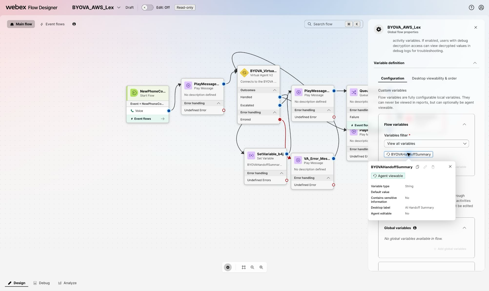
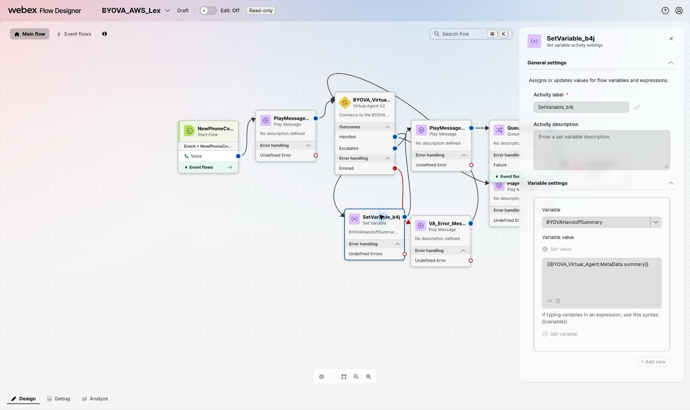
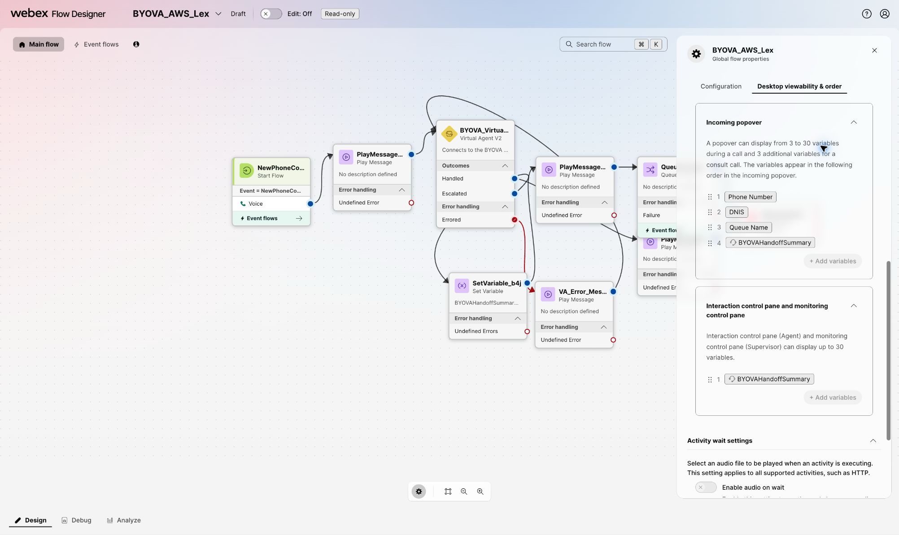
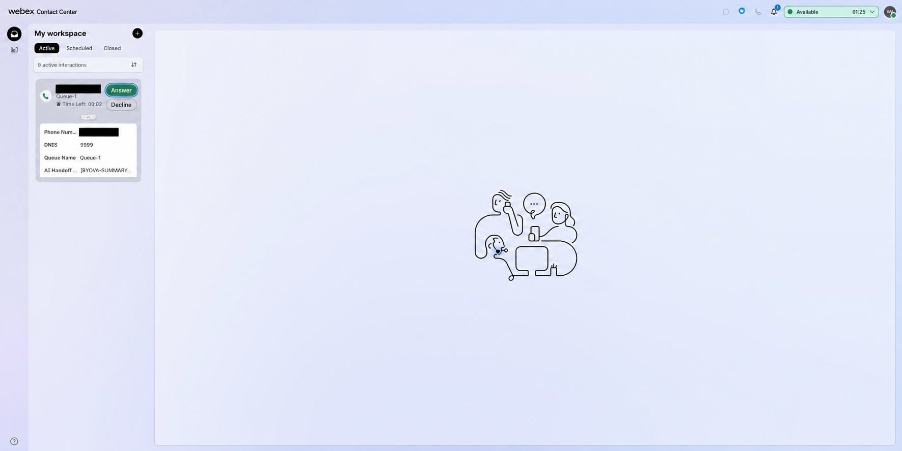
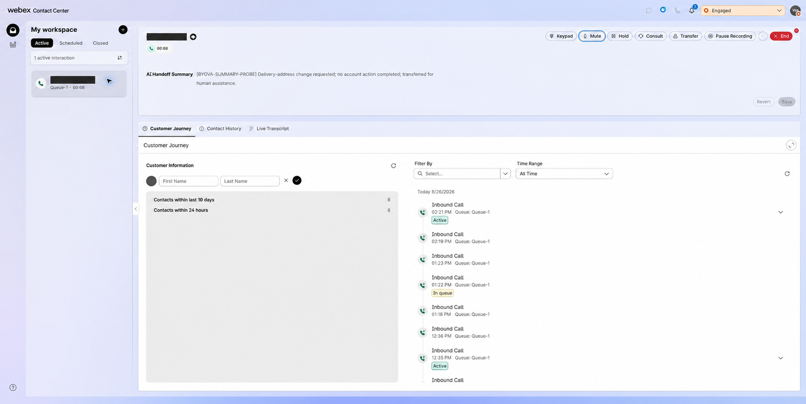

# Passing Virtual-Agent Handoff Context to Webex Contact Center

This document defines a provider-neutral contract for passing an optional handoff summary and
routing hint from a BYOVA virtual agent to Webex Contact Center (WxCC) when the call transfers
to a human agent. The summary helps the receiving agent understand the caller's request without
asking the caller to repeat it. The routing hint lets the customer's flow select an approved
human queue without exposing queue identifiers to the virtual-agent provider.

The contract applies to any virtual-agent provider. Each connector remains responsible for
translating its provider's terminal response into the canonical gateway fields described
below.

## Intended Agent Experience

When the virtual agent escalates a call, the human agent should receive a concise handoff
summary:

- In the incoming-interaction popover before answering
- In the Interaction Control pane after answering
- Without depending on a provider-specific Agent Desktop widget

This document covers the handoff behavior verified by this implementation.

## Data Flow

```text
Virtual-agent provider
        |
        | provider-specific terminal event, summary, and symbolic classification
        v
Provider connector
        |
        | canonical handoff data
        v
BYOVA gateway
        |
        | final VoiceVAResponse with TRANSFER_TO_AGENT
        v
WxCC Virtual Agent V2 activity
        |
        | output-event metadata.summary and metadata.routing_hint
        v
Agent-viewable flow variable
        |
        +--> incoming-interaction popover
        +--> Interaction Control pane
```

The provider may generate the summary itself or return structured facts from which the
connector builds a summary. The WxCC-facing response must not depend on which approach the
provider uses.

## Canonical Gateway Handoff Data

Provider connectors should normalize terminal handoff data into one internal shape before
the gateway creates the BYOVA response:

```json
{
  "message_type": "transfer",
  "handoff": {
    "summary": "Caller wants to change the delivery address. The virtual agent did not modify the order. Verify the caller and update the address.",
    "routing_hint": "delivery_address_specialist"
  }
}
```

`handoff.summary` contains the text intended for the receiving agent. `handoff.routing_hint`
is an optional stable symbolic business classification. It must be a 1-64 character ASCII
identifier that begins with a letter and contains only letters, numbers, `_`, or `-` (for
example, `billing_specialist`). Numeric queue IDs, free-form text, empty values, and malformed
values are omitted.

Connectors should not leak their provider's raw terminal payload into the gateway contract.
They should extract only the approved fields and normalize them into this shape. The virtual
agent sends the business classification; the customer owns the mapping from that classification
to WxCC queue IDs.

### Connector integration contract

This is a gateway contract, not a GECX feature. Any connector can extract equivalent terminal
data from its provider and attach the canonical handoff object to its `transfer` response:

```python
from src.utils.handoff import normalize_handoff

handoff = normalize_handoff(
    {
        "summary": provider_summary,
        "routing_hint": provider_business_classification,
    }
)
return self.create_response(
    conversation_id=conversation_id,
    message_type="transfer",
    handoff=handoff,
)
```

`normalize_handoff()` is the shared gateway allowlist. It discards provider-specific fields,
invalid values, and raw queue IDs; connectors must never pass the full provider terminal
payload. GECX uses this helper for `EndSession.metadata`, but no GECX dependency exists in the
gateway contract.

## BYOVA Transfer Response

The gateway should create one final `VoiceVAResponse` containing one
`TRANSFER_TO_AGENT` output event. The following pseudocode shows the intended wire shape:

```json
{
  "response_type": "FINAL",
  "session_summary": {
    "text": "Caller wants to change the delivery address. The virtual agent did not modify the order. Verify the caller and update the address.",
    "language_code": "en-US"
  },
  "output_events": [
    {
      "event_type": "TRANSFER_TO_AGENT",
      "name": "transfer_requested",
      "metadata": {
        "summary": "Caller wants to change the delivery address. The virtual agent did not modify the order. Verify the caller and update the address.",
        "routing_hint": "delivery_address_specialist"
      }
    }
  ]
}
```

The fields serve different purposes:

| Field | Purpose | Requirement |
| --- | --- | --- |
| `output_events[].metadata.summary` | Makes the summary available to the WxCC flow as transfer metadata | Required for the validated Agent Desktop path |
| `output_events[].metadata.routing_hint` | Makes the stable routing classification available to the WxCC flow | Optional; sent only on `TRANSFER_TO_AGENT` |
| `session_summary` | Uses the dedicated BYOVA session-summary field | Recommended when a summary is available |

The summary is intentionally present in both `session_summary` and transfer metadata. The
dedicated field preserves the BYOVA semantic model, while `metadata.summary` supports the
current WxCC flow-variable and Agent Desktop path. `routing_hint` is intentionally not copied
to `session_summary`; it appears only in the one terminal transfer event's metadata.

The relevant protocol definitions are:

- [`VoiceVAResponse.session_summary`](../proto/voicevirtualagent.proto)
- [`OutputEvent.TRANSFER_TO_AGENT` and `metadata`](../proto/byova_common.proto)

## WxCC Flow Mapping

In Flow Designer, the Virtual Agent V2 activity exposes transfer-event metadata through its
`MetaData` output. Map the normalized `summary` key to a custom String flow variable:

```text
BYOVAHandoffSummary = {{BYOVA_Virtual_Agent.MetaData.summary}}
```

Map the optional routing hint to a separate String flow variable:

```text
BYOVARoutingHint = {{BYOVA_Virtual_Agent.MetaData.routing_hint}}
```

The Virtual Agent activity name is flow-specific; replace `BYOVA_Virtual_Agent` with the
actual activity name. Configure the summary variable as:

| Setting | Value |
| --- | --- |
| Type | String |
| Desktop label | AI Handoff Summary |
| Agent viewable | Enabled |
| Agent editable | Disabled |

These settings live in the flow's **Global flow properties**. They do not require a custom
Agent Desktop JSON layout.

Configure `BYOVARoutingHint` separately in the same location:

| Setting | Value |
| --- | --- |
| Type | String |
| Default value | Empty |
| Agent viewable | Disabled |
| Agent editable | Disabled |

`BYOVARoutingHint` is a routing-only value. Do not add it to an Agent Desktop surface or use
it as a customer-facing label. The flow owns the mapping from its symbolic value to an approved
queue.

### 1. Create the agent-viewable variable

Open **Variable definition > Configuration**, create the String variable, and leave its
default value empty. The summary must be designed to exclude secrets, payment data, and other
content that should not appear in an incoming offer. The following nonproduction example uses
synthetic, non-sensitive content.



### 2. Copy the transfer metadata into the variable

On the Virtual Agent V2 **Escalated** branch, add a **Set Variable** activity before the
activity that queues the contact for a human agent. Select `BYOVAHandoffSummary`, choose
**Set value**, and enter the metadata expression shown above. Use the flow's actual Virtual
Agent activity name in the expression.



The surrounding nodes in this screenshot belong to a nonproduction example flow. The
provider-neutral requirement is the selected variable and expression, not the example's
activity names or other branches.

Keep the human-routing path independent of the optional value:

- Connect the Set Variable success path to the normal human queue path.
- If the flow treats a missing nested `summary` key as an **Undefined Error**, connect that
  error path to the same human queue path, or guard the assignment with an equivalent
  condition.
- Do not disconnect the contact or send it to a Virtual Agent failure branch only because
  the summary is absent.
- Do not invent a fallback summary. Leave the agent-viewable variable empty when no summary
  was supplied.

### 3. Route with an approved customer-owned queue map

On the Virtual Agent V2 **Escalated** branch, add a second **Set Variable** activity after the
summary assignment. Select `BYOVARoutingHint`, choose **Set value**, and enter the routing-hint
expression shown above. Connect its success path to a **Case** activity whose input is
`BYOVARoutingHint`.

Configure the Case branches only with classifications approved by the customer. For example:

| Case value | Flow action |
| --- | --- |
| `billing_specialist` | Queue Contact to the approved billing queue |
| `delivery_address_specialist` | Queue Contact to the approved delivery-address queue |
| Default | Queue Contact to the normal fallback human queue |

The labels above are examples, not gateway configuration. Do not ask the virtual agent to send
a WxCC queue ID and do not use a provider-supplied ID directly as a queue target. The customer
can add, remove, or remap classifications in Flow Designer without changing the provider or
gateway.

Always connect the Case activity's **Default** branch to the normal fallback human queue. This
default handles a missing, empty, malformed, or unknown hint so the human transfer still
succeeds. If a missing nested `routing_hint` key produces an **Undefined Error** in the Set
Variable activity, connect that error path to the same fallback human queue, or guard the
assignment with an equivalent condition. Do not send the contact to a Virtual Agent failure
branch only because the optional routing hint is absent.

### 4. Select the Agent Desktop surfaces

Open **Variable definition > Desktop viewability & order**. Add
`BYOVAHandoffSummary` to both **Incoming popover** and **Interaction control pane and
monitoring control pane**, then place it in the desired order. Publish the flow after the
configuration has been validated.



The transfer must continue when the provider does not supply a summary or routing hint; absent
handoff data is not a routing failure.

### 5. Validate before publishing

Before publishing the flow, use synthetic handoff values to verify each approved Case branch,
the Default branch for an unknown hint, and the fallback path for a missing hint. Confirm that
only `BYOVAHandoffSummary` appears in the incoming popover and interaction control pane, and
that both missing-field error paths still reach a human queue. Do not add real queue IDs,
customer data, or provider diagnostics to the test values.

## Validated Agent Desktop Behavior

The following screenshots were captured in a nonproduction WxCC organization with synthetic
handoff content. They prove the WxCC metadata-to-flow-variable-to-desktop path. They do not
prove that any specific provider generates a summary automatically.

### Before the agent answers

The incoming-interaction popover includes **AI Handoff Summary** with the other request
details. The narrow popover may truncate a long value, so the summary should lead with the
caller's request and requested next action.



### After the agent answers

The full summary appears at the top of the active interaction, directly below the call
controls.



The synthetic marker in these screenshots was added by a development-only terminal insight
probe. A production implementation must replace that probe with provider-neutral handoff
normalization and pass-through.

## Gateway Requirements

The production gateway implementation should:

1. Accept normalized `summary` and `routing_hint` fields from every connector that can provide
   them.
2. Create exactly one terminal `TRANSFER_TO_AGENT` output event.
3. Copy the summary into that event's `metadata.summary` field.
4. Copy the routing hint only into that event's `metadata.routing_hint` field.
5. Populate `session_summary` with the same summary text when available, never with the routing
   hint.
6. Allowlist supported metadata fields rather than forwarding an arbitrary provider payload or
   raw customer queue ID.
7. Enforce valid scalar types and the symbolic routing-hint format.
8. Never write handoff content to logs, metrics, traces, or error messages.
9. Preserve transfer behavior when either optional field is missing, malformed, or unknown.

The gateway should log only safe operational facts such as whether a field was present, its
character count, and whether validation accepted or omitted it.

## Summary Content Guidance

A useful handoff summary should be factual, brief, and ordered for the receiving agent. It
should include:

- Why the caller contacted the virtual agent
- Important information the caller supplied
- Actions the virtual agent completed or explicitly did not complete
- The reason for escalation
- The next action expected from the human agent

Do not include credentials, authentication tokens, payment data, unnecessary sensitive
personal information, unsupported conclusions, or hidden provider diagnostics. Prefer plain
text over Markdown because the Agent Desktop variable is rendered as text.

## Verification

Automated coverage should verify:

- A transfer with summary and routing hint creates one transfer event containing both allowlisted
  metadata keys.
- The summary, but never the routing hint, appears in `session_summary`.
- A transfer without valid handoff data still succeeds.
- Non-transfer responses do not receive handoff fields.
- Invalid routing hints and provider queue IDs are omitted.
- Handoff values do not appear in logs.
- Provider-specific fields do not escape the connector boundary.

End-to-end acceptance should verify:

1. The provider or test connector produces synthetic summary and symbolic routing-hint values.
2. The gateway emits a final response with one `TRANSFER_TO_AGENT` event.
3. The WxCC flow assigns `MetaData.summary` to the agent-viewable variable and
   `MetaData.routing_hint` to `BYOVARoutingHint`.
4. The Case activity maps an approved hint to its approved queue and sends missing or unknown
   hints to the default human queue.
5. The incoming offer shows the summary before answer.
6. The active interaction shows the full summary after answer.
7. The call routes and completes normally when the summary or routing hint is absent.

Use synthetic content for all nonproduction validation. Disable any terminal test probe after
the test and restore the environment's approved gateway release.
